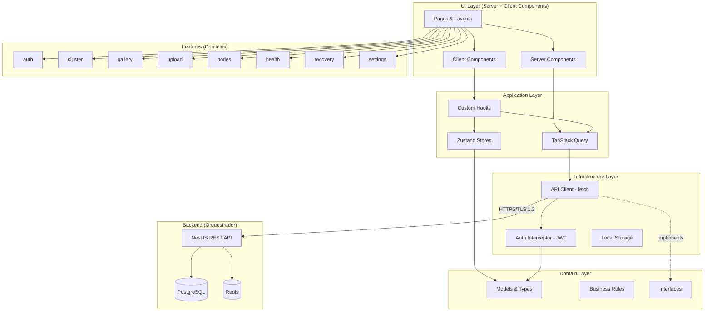

# Arquitetura do Frontend

Define a arquitetura em camadas do frontend, inspirada em Clean Architecture adaptada para aplicacoes client-side. Estabelece fronteiras claras entre UI, logica de aplicacao, dominio e infraestrutura, garantindo que cada parte do sistema tenha responsabilidade bem definida e que mudancas em uma camada nao impactem as demais.

> **Implementa:** [docs/blueprint/06-system-architecture.md](../blueprint/06-system-architecture.md) (componentes e deploy) e [docs/blueprint/02-architecture_principles.md](../blueprint/02-architecture_principles.md) (principios).
> **Complementa:** [docs/backend/01-architecture.md](../backend/01-architecture.md) (camadas do backend).

---

## Camadas Arquiteturais

> Como o frontend esta organizado em camadas? Qual a responsabilidade de cada uma?

```
UI Layer (Pages, Layouts, Components)
        ↓
Application Layer (Hooks, Orchestration, State)
        ↓
Domain Layer (Models, Business Rules, Interfaces)
        ↓
Infrastructure Layer (API Client, Storage, Analytics)
```

| Camada | Responsabilidade | Pode acessar | NAO pode acessar |
| --- | --- | --- | --- |
| UI Layer | Renderizacao de paginas, layouts, componentes visuais, interacao com o usuario. Server Components para dados estaticos, Client Components para interatividade | Application, Domain | Infrastructure diretamente |
| Application Layer | Orquestracao de fluxos (upload, recovery, onboarding), hooks de negocio, gerenciamento de estado, tratamento de loading/error | Domain, Infrastructure | — |
| Domain Layer | Modelos de entidades (Cluster, Member, File, Node, Alert), regras de negocio client-side (validacao de roles, status de replicacao), interfaces/types compartilhados | Nenhuma outra camada | UI, Application, Infrastructure |
| Infrastructure Layer | API client HTTP (fetch para Orquestrador NestJS), local storage, cache, interceptors de auth (JWT), retry com backoff, upload multipart | Domain (implementa interfaces) | UI, Application |

<details>
<summary>Exemplo — Responsabilidade de cada camada no Alexandria</summary>

- **UI Layer:** `GalleryPage` renderiza grid de thumbnails usando Server Components para SSR. `FileUploader` e Client Component com drag-and-drop e progress bar.
- **Application Layer:** `useUploadFile()` orquestra o fluxo: valida tamanho (RN-F4), envia multipart para API, monitora status do pipeline, atualiza cache do TanStack Query ao concluir.
- **Domain Layer:** `File` define o modelo com `media_type`, `status`, `content_hash`. `canUpload(member)` verifica se role permite upload (RN-M3). `isReplicationHealthy(file)` verifica se todos os chunks tem 3+ replicas.
- **Infrastructure Layer:** `filesApi.upload(file)` faz POST /files/upload multipart com JWT no header, retry automatico em falha de rede, progress callback via XMLHttpRequest.

</details>

---

## Regras de Dependencia

> Quais sao as regras de importacao entre camadas?

- UI Layer pode importar de Application e Domain
- Application Layer pode importar de Domain e Infrastructure
- Domain Layer NAO importa de nenhuma outra camada (puro TypeScript, zero dependencias externas)
- Infrastructure Layer implementa interfaces definidas em Domain

> A regra de ouro: dependencias apontam sempre para dentro (em direcao ao Domain). Nenhuma camada interna conhece camadas externas.

### Regras adicionais

- **Server Components** (UI Layer) podem fazer fetch direto via Infrastructure, mas somente para dados de leitura (galeria, lista de alertas). Mutacoes sempre passam pela Application Layer.
- **Imports entre features** sao proibidos. Se duas features precisam do mesmo tipo ou componente, ele vive em `shared/`.
- **Domain Layer** e isomorfico — roda no servidor (Server Components) e no cliente sem adaptacao.
- **Infrastructure Layer** encapsula TODA comunicacao com o backend. Nenhum `fetch()` direto fora desta camada.

---

## Fronteiras de Dominio

> O frontend esta organizado por dominio de negocio (features)?

<!-- do blueprint: 04-domain-model.md + 08-use_cases.md -->

| Dominio | Responsabilidade | Componentes Proprios | Estado Proprio |
| --- | --- | --- | --- |
| auth | Autenticacao (login, logout), autorizacao por role (admin, member, reader), sessao JWT | LoginForm, AuthGuard, RoleGate | authStore (sessao, member, role) |
| cluster | Criacao de cluster, seed phrase, convite de membros, governanca | ClusterSetup, SeedPhraseDisplay, InviteForm, MemberList | clusterStore (cluster ativo, membros) |
| gallery | Galeria de arquivos, grid, timeline, busca, preview de fotos/videos/docs | GalleryGrid, TimelineView, FilePreview, SearchBar, FileDetail | galleryStore (filtros, paginacao, file selecionado) |
| upload | Upload de arquivos, status do pipeline, progresso, retry | FileUploader, UploadProgress, UploadQueue, ProcessingStatus | uploadStore (fila, progresso, status) |
| nodes | Registro de nos, monitoramento, heartbeat status, drain | NodeList, NodeCard, AddNodeForm, NodeDetail, DrainProgress | nodesStore (lista de nos, status) |
| health | Dashboard de saude do cluster, alertas, metricas de replicacao | HealthDashboard, AlertList, AlertDetail, ReplicationStatus | healthStore (alertas, metricas) |
| recovery | Recovery via seed phrase, rebuild do sistema, status de reconexao | RecoveryForm, RecoveryProgress, RecoveryReport | recoveryStore (etapa, progresso) |
| settings | Configuracoes do membro, vault, preferencias | SettingsPage, VaultManager, ProfileForm | settingsStore (preferencias) |

<!-- APPEND:dominios -->

> Cada dominio possui: `components/`, `hooks/`, `api/`, `types/`, `services/`

> Detalhes da estrutura de pastas: (ver 02-project-structure.md)

---

## Comunicacao entre Dominios

> Como features diferentes se comunicam sem acoplamento direto?

- Features NAO importam diretamente umas das outras
- Comunicacao via **TanStack Query cache** como fonte de verdade compartilhada — quando `upload` finaliza, invalida a query key de `gallery` e os dados se atualizam automaticamente
- Eventos cross-feature via **custom events** leves (EventTarget API nativa) para notificacoes pontuais (ex.: upload concluido → toast na gallery)
- Componentes compartilhados vivem fora das features, em `shared/components/`
- Tipos compartilhados (entidades do dominio) vivem em `shared/domain/`

### Exemplos de comunicacao

| Origem | Destino | Mecanismo | Cenario |
| --- | --- | --- | --- |
| upload | gallery | TanStack Query invalidation | Upload finalizado → galeria recarrega lista de arquivos |
| health | nodes | TanStack Query invalidation | Alerta de no offline → lista de nos atualiza status |
| auth | todos | authStore (Zustand) | Logout → todos os stores resetados |
| cluster | auth | Redirect | Cluster criado → redireciona para login do admin |
| nodes | health | TanStack Query invalidation | No registrado → dashboard recalcula metricas |

> Detalhes sobre Event Bus: (ver 05-state.md)

---

## Comunicacao com o Backend

> Como o frontend se comunica com o Orquestrador (NestJS REST API)?

<!-- do blueprint: 06-system-architecture.md + 07-critical_flows.md -->

| Aspecto | Decisao | Justificativa |
| --- | --- | --- |
| Protocolo | REST sobre HTTPS (TLS 1.3) | Simplicidade; alinhado com principio de Simplicidade Operacional |
| Formato | JSON | Padrao universal; tipagem via Zod no frontend |
| Autenticacao | JWT no header `Authorization: Bearer <token>` | Stateless; alinhado com ADR-005 (seguranca) |
| Upload de arquivos | Multipart form-data via POST /files/upload | Suporte nativo do browser; progress tracking |
| Paginacao | Cursor-based (campo `cursor` + `limit`) | Performance superior a OFFSET para grandes volumes |
| Erros | Formato padronizado `{ error: string, code: string, details?: object }` | Tratamento uniforme no interceptor da Infrastructure Layer |
| Versionamento | Prefixo `/api/v1/` | Alinhado com estrategia de versionamento do blueprint |

### Endpoints principais consumidos pelo frontend

| Feature | Metodo | Endpoint | Descricao |
| --- | --- | --- | --- |
| auth | POST | /api/v1/auth/login | Login com email + senha |
| auth | POST | /api/v1/auth/refresh | Renovar JWT |
| cluster | POST | /api/v1/clusters | Criar cluster familiar |
| cluster | POST | /api/v1/clusters/:id/invite | Gerar convite |
| cluster | POST | /api/v1/invites/:token/accept | Aceitar convite |
| gallery | GET | /api/v1/files?cursor=&limit=&media_type= | Listar arquivos (paginado) |
| gallery | GET | /api/v1/files/:id | Detalhes do arquivo + metadata |
| gallery | GET | /api/v1/files/:id/preview | Servir preview (thumbnail/video) |
| gallery | GET | /api/v1/files/:id/download | Download do arquivo otimizado |
| upload | POST | /api/v1/files/upload | Upload multipart |
| nodes | GET | /api/v1/nodes | Listar nos do cluster |
| nodes | POST | /api/v1/nodes | Registrar novo no |
| nodes | POST | /api/v1/nodes/:id/drain | Iniciar drain |
| health | GET | /api/v1/alerts?resolved=false | Alertas ativos |
| health | GET | /api/v1/cluster/health | Metricas de saude (nos, replicacao, capacidade) |
| recovery | POST | /api/v1/recovery/seed | Iniciar recovery via seed phrase |
| recovery | GET | /api/v1/recovery/status | Status do recovery em andamento |
| settings | GET | /api/v1/members/me | Dados do membro autenticado |
| settings | PUT | /api/v1/members/me | Atualizar perfil |

---

## Diagrama de Arquitetura

> 📐 Diagrama: [frontend-architecture.mmd](../diagrams/frontend/frontend-architecture.mmd)

Visao geral da arquitetura em camadas com as features de dominio e comunicacao com o backend.



> Mantenha o diagrama atualizado conforme a arquitetura evolui. (ver 00-frontend-vision.md para contexto geral)
