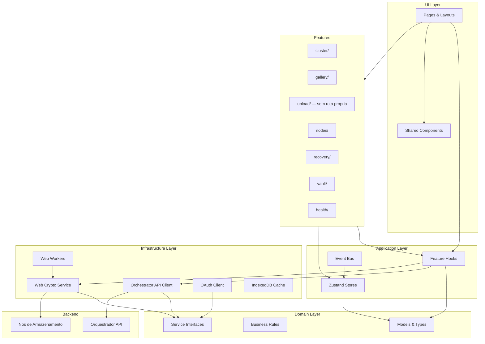

# Arquitetura do Frontend

Define a arquitetura em camadas do frontend, inspirada em Clean Architecture adaptada para aplicacoes client-side. Estabelece fronteiras claras entre UI, logica de aplicacao, dominio e infraestrutura, garantindo que cada parte do sistema tenha responsabilidade bem definida e que mudancas em uma camada nao impactem as demais.

---

## Camadas Arquiteturais

> Como o frontend esta organizado em camadas? Qual a responsabilidade de cada uma?

```
UI Layer (Pages, Layouts, Components)
        ↓
Application Layer (Hooks, Orchestration, State)
        ↓
Domain Layer (Models, Business Rules, Interfaces)
        ↓
Infrastructure Layer (API Client, Crypto, Storage Providers)
```

| Camada | Responsabilidade | Pode acessar | NAO pode acessar |
| --- | --- | --- | --- |
| UI Layer | Renderizacao de galeria, dashboards, formularios de configuracao, estados visuais (loading/vazio/erro/sucesso) | Application, Domain | Infrastructure diretamente |
| Application Layer | Orquestracao de upload pipeline, sync engine, gerenciamento de estado de cluster/nos/replicacao | Domain, Infrastructure | — |
| Domain Layer | Modelos (Cluster, Member, Node, Manifest, Chunk), regras de negocio (permissoes, replicacao minima, quotas), interfaces de servicos | Nenhuma outra camada | UI, Application, Infrastructure |
| Infrastructure Layer | API client do orquestrador, Web Crypto API (AES-256-GCM), StorageProvider adapters, OAuth client, cache local (IndexedDB) | Domain (implementa interfaces) | UI, Application |

<details>
<summary>Exemplo — Responsabilidade de cada camada no Alexandria</summary>

- **UI Layer:** `GalleryPage` renderiza grid de thumbnails com virtualizacao. Nao sabe como fotos foram criptografadas ou de qual no vieram.
- **Application Layer:** `useUploadPipeline(file)` orquestra o fluxo: analise → resize → encrypt → chunk → distribute. Gerencia progresso e retry.
- **Domain Layer:** `Chunk` define modelo com `hash`, `size`, `replicas`. `canRemoveNode(node, cluster)` valida se todos os chunks do no tem replicas suficientes antes do drain.
- **Infrastructure Layer:** `orchestratorApi.getManifest(fileId)` faz o fetch HTTP com mutual auth. `cryptoService.encryptChunk(data, key)` executa AES-256-GCM via Web Crypto API em Web Worker.

</details>

---

## Regras de Dependencia

> Quais sao as regras de importacao entre camadas?

- UI Layer pode importar de Application e Domain
- Application Layer pode importar de Domain e Infrastructure
- Domain Layer NAO importa de nenhuma outra camada
- Infrastructure Layer implementa interfaces definidas em Domain

> A regra de ouro: dependencias apontam sempre para dentro (em direcao ao Domain). Nenhuma camada interna conhece camadas externas.

**Regras especificas do Alexandria:**

- Modulos de criptografia (Infrastructure) sao acessados apenas via hooks da Application Layer — UI nunca manipula chaves ou dados em texto puro
- Web Workers para operacoes pesadas (encrypt, hash, resize) sao encapsulados na Infrastructure Layer e expostos via interfaces do Domain
- core-sdk (compartilhado com Tauri e React Native) vive no Domain e Infrastructure — nunca depende de React ou APIs de browser

---

## Fronteiras de Dominio

> O frontend esta organizado por dominio de negocio (features)?

| Dominio | Responsabilidade | Componentes Proprios | Estado Proprio |
| --- | --- | --- | --- |
| cluster | Criacao do grupo familiar, convite de membros, permissoes, governanca | ClusterSetup, InviteFlow, MemberList, PermissionManager | clusterStore |
| gallery | Visualizacao de fotos/videos, timeline cronologica, busca por metadados, download sob demanda | GalleryGrid, PhotoCard, VideoPlayer, Timeline, SearchBar | galleryStore |
| upload | Pipeline de upload integrado na galeria e sync automatico, processamento, status de progresso, fila de uploads. Sem rota/pagina propria | UploadDropzone, SyncStatus, ProcessingQueue, ProgressBar | uploadStore |
| nodes | Registro e gerenciamento de nos, integracao OAuth com provedores cloud, heartbeat, quotas | NodeList, NodeCard, CloudConnector, OAuthRedirect, QuotaBar | nodesStore |
| recovery | Geracao e exibicao de seed phrase, fluxo de recuperacao do orquestrador, disaster recovery | SeedPhraseDisplay, RecoveryWizard, SeedInput | recoveryStore |
| vault | Vault criptografado do membro, gerenciamento de tokens OAuth, credenciais | VaultUnlock, CredentialList, TokenStatus | vaultStore |
| health | Dashboard de saude do cluster, replicacao, alertas, capacidade, logs de operacoes | HealthDashboard, ReplicationStatus, AlertList, CapacityChart | healthStore |

<!-- APPEND:dominios -->

> Cada dominio possui: `components/`, `hooks/`, `api/`, `types/`, `services/`

> Detalhes da estrutura de pastas: (ver 02-estrutura-projeto.md)

---

## Comunicacao entre Dominios

> Como features diferentes se comunicam sem acoplamento direto?

- Features NAO importam diretamente umas das outras
- Comunicacao via Event Bus leve para eventos de sistema (ex: `upload:complete` notifica `gallery` para revalidar, `node:offline` notifica `health` para atualizar status)
- Estado global compartilhado via stores Zustand para dados cross-domain (ex: `authStore` compartilha identidade do membro entre todas as features)
- Componentes compartilhados (Button, Modal, Toast, Card) vivem fora das features, em `components/ui/`

**Exemplos de eventos entre dominios:**

| Evento | Produtor | Consumidor | Acao |
| --- | --- | --- | --- |
| `upload:complete` | upload | gallery | Revalidar query de fotos, adicionar thumbnail ao cache |
| `node:status-changed` | nodes | health | Atualizar dashboard, disparar alerta se no ficou offline |
| `cluster:member-joined` | cluster | nodes | Listar novos dispositivos disponiveis do membro |
| `vault:unlocked` | vault | nodes | Disponibilizar tokens OAuth para sync com provedores cloud |
| `recovery:started` | recovery | cluster, nodes | Bloquear operacoes de escrita durante reconstrucao |

> Detalhes sobre Event Bus: (ver 05-estado.md)

---

## Diagrama de Arquitetura

> Diagrama: [frontend-architecture.mmd](../diagrams/frontend/frontend-architecture.mmd)

O diagrama abaixo mostra a organizacao em camadas e a relacao entre features, infraestrutura e o backend (orquestrador + nos de armazenamento).



> Mantenha o diagrama atualizado conforme a arquitetura evolui. (ver 00-visao-frontend.md para contexto geral)
