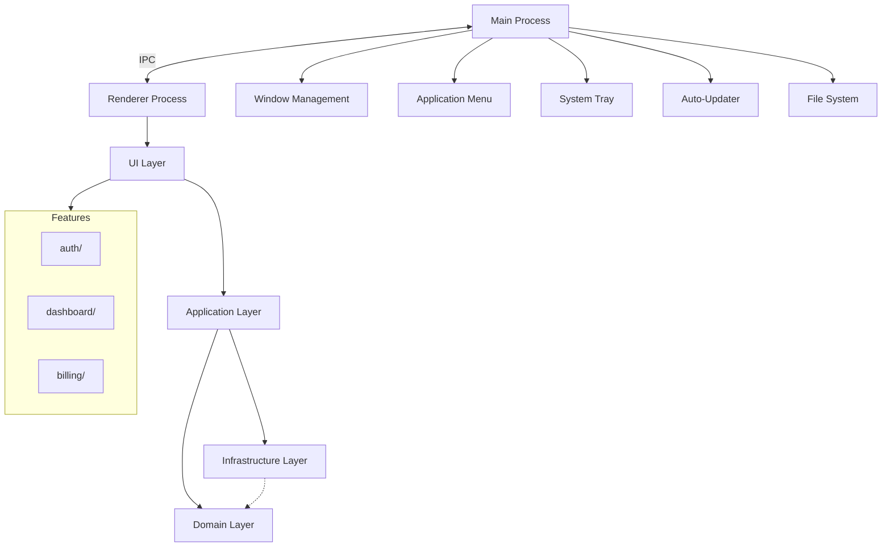

# Arquitetura do Frontend Desktop

Define a arquitetura em camadas do frontend desktop, inspirada em Clean Architecture adaptada para aplicacoes desktop com Electron / Tauri. Estabelece fronteiras claras entre UI, logica de aplicacao, dominio e infraestrutura, alem da separacao fundamental entre main process e renderer process.

> **Implementa:** [docs/blueprint/06-system-architecture.md](../blueprint/06-system-architecture.md) (componentes e deploy) e [docs/blueprint/02-architecture_principles.md](../blueprint/02-architecture_principles.md) (principios).
> **Complementa:** [docs/backend/01-architecture.md](../backend/01-architecture.md) (camadas do backend).

---

## Arquitetura de Processos

> Como a aplicacao desktop separa responsabilidades entre processos?

```
Main Process (Node.js / Rust)
  ├── Window Management
  ├── Application Menu
  ├── System Tray
  ├── Auto-Updater
  ├── File System Access
  ├── Native APIs
  └── IPC Handlers
        ↕ IPC (Inter-Process Communication)
Renderer Process (Chromium / WebView)
  ├── UI Layer (Pages, Layouts, Components)
  ├── Application Layer (Hooks, State)
  ├── Domain Layer (Models, Rules)
  └── Infrastructure Layer (API Client, IPC Client)
```

| Processo | Responsabilidade | Acesso | Tecnologia |
| --- | --- | --- | --- |
| Main Process | Gerenciamento de janelas, menus, tray, auto-update, acesso ao file system | Node.js APIs completas / Rust APIs | Electron main / Tauri Rust backend |
| Renderer Process | Interface do usuario, interacao, renderizacao | APIs do browser (sandboxed) | React / Vue / Svelte no Chromium / WebView |
| Preload Script (Electron) | Ponte segura entre main e renderer | contextBridge APIs expostas | Script isolado com acesso limitado |

---

## Camadas Arquiteturais (Renderer)

> Como o renderer process esta organizado em camadas? Qual a responsabilidade de cada uma?

```
UI Layer (Pages, Layouts, Components)
        ↓
Application Layer (Hooks, Orchestration, State)
        ↓
Domain Layer (Models, Business Rules, Interfaces)
        ↓
Infrastructure Layer (API Client, IPC Client, Storage)
```

| Camada | Responsabilidade | Pode acessar | NAO pode acessar |
| --- | --- | --- | --- |
| UI Layer | Renderizacao, interacao visual, layout | Application, Domain | Infrastructure diretamente |
| Application Layer | Orquestracao, hooks de negocio, estado | Domain, Infrastructure | — |
| Domain Layer | Modelos, regras de negocio, interfaces | Nenhuma outra camada | UI, Application, Infrastructure |
| Infrastructure Layer | API client, IPC client, storage, analytics | Domain (implementa interfaces) | UI, Application |

<details>
<summary>Exemplo — Responsabilidade de cada camada</summary>

- **UI Layer:** `UserProfilePage` renderiza dados do usuario usando componentes visuais. Nao sabe de onde vem os dados.
- **Application Layer:** `useUserProfile(id)` orquestra o fetch via IPC ou API, trata loading/error e retorna dados prontos para a UI.
- **Domain Layer:** `User` define o modelo, `canEditProfile(user)` contem a regra de negocio.
- **Infrastructure Layer:** `userApi.getById(id)` faz o fetch HTTP real ou envia mensagem IPC ao main process.

</details>

---

## Comunicacao IPC

> Como main process e renderer process se comunicam?

| Direcao | Metodo | Uso Tipico |
| --- | --- | --- |
| Renderer → Main | `ipcRenderer.invoke()` / Tauri `invoke()` | Solicitar dados, executar acoes no OS |
| Main → Renderer | `webContents.send()` / Tauri events | Notificar mudancas, push de dados |
| Bidirecional | Event emitters tipados | Sincronizacao de estado em tempo real |

> Todas as mensagens IPC devem ser tipadas e validadas em ambos os lados.

<details>
<summary>Exemplo — IPC tipado (Electron)</summary>

```typescript
// shared/ipc-channels.ts
export const IPC_CHANNELS = {
  GET_USER: 'user:get',
  SAVE_FILE: 'file:save',
  APP_UPDATE_AVAILABLE: 'app:update-available',
} as const;

// main/ipc/user-handlers.ts
ipcMain.handle(IPC_CHANNELS.GET_USER, async (event, userId: string) => {
  return await userService.getById(userId);
});

// renderer/services/ipc-client.ts
export const ipcClient = {
  getUser: (userId: string) =>
    window.electronAPI.invoke(IPC_CHANNELS.GET_USER, userId),
};
```

</details>

---

## Regras de Dependencia

> Quais sao as regras de importacao entre camadas?

- UI Layer pode importar de Application e Domain
- Application Layer pode importar de Domain e Infrastructure
- Domain Layer NAO importa de nenhuma outra camada
- Infrastructure Layer implementa interfaces definidas em Domain
- Renderer NUNCA importa diretamente de modulos Node.js — sempre via IPC/preload

> A regra de ouro: dependencias apontam sempre para dentro (em direcao ao Domain). Nenhuma camada interna conhece camadas externas.

---

## Fronteiras de Dominio

> O frontend desktop esta organizado por dominio de negocio (features)?

| Dominio | Responsabilidade | Componentes Proprios | Estado Proprio |
| --- | --- | --- | --- |
| {{auth}} | {{Autenticacao e autorizacao}} | {{LoginForm, AuthGuard}} | {{authStore}} |
| {{dashboard}} | {{Painel principal e metricas}} | {{DashboardGrid, MetricCard}} | {{dashboardStore}} |
| {{billing}} | {{Planos, pagamentos e faturas}} | {{PlanSelector, InvoiceList}} | {{billingStore}} |
| {{storage}} | {{Upload e gerenciamento de arquivos}} | {{FileUploader, FileList}} | {{storageStore}} |
| {{Outro dominio}} | {{Responsabilidade}} | {{Componentes}} | {{Store}} |

<!-- APPEND:dominios -->

> Cada dominio possui: `components/`, `hooks/`, `api/`, `types/`, `services/`

> Detalhes da estrutura de pastas: (ver 02-project-structure.md)

---

## Comunicacao entre Dominios

> Como features diferentes se comunicam sem acoplamento direto?

- Features NAO importam diretamente umas das outras
- Comunicacao via Event Bus leve ou estado global compartilhado
- Componentes compartilhados vivem fora das features, em `components/`

> Detalhes sobre Event Bus: (ver 05-state.md)

---

## Diagrama de Arquitetura

> Diagrama: [desktop-architecture.mmd](../diagrams/frontend/desktop-architecture.mmd)

{{Descreva o diagrama de arquitetura ou referencie o arquivo Mermaid}}



> Mantenha o diagrama atualizado conforme a arquitetura evolui. (ver 00-frontend-vision.md para contexto geral)
