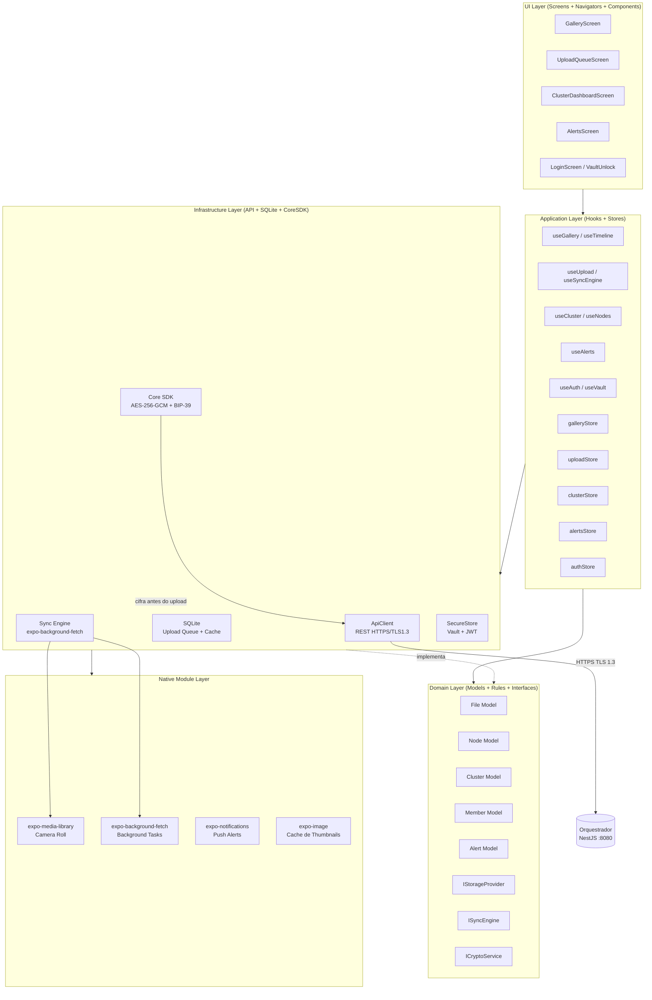

# Arquitetura do Frontend Mobile

Define a arquitetura em camadas do app mobile, inspirada em Clean Architecture adaptada para aplicacoes React Native. Estabelece fronteiras claras entre UI, logica de aplicacao, dominio e infraestrutura, garantindo que cada parte do sistema tenha responsabilidade bem definida e que mudancas em uma camada nao impactem as demais.

> **Implementa:** [docs/blueprint/06-system-architecture.md](../blueprint/06-system-architecture.md) (componentes e deploy) e [docs/blueprint/02-architecture_principles.md](../blueprint/02-architecture_principles.md) (principios).
> **Complementa:** [docs/backend/01-architecture.md](../backend/01-architecture.md) (camadas do backend).

---

## Camadas Arquiteturais

> Como o app mobile esta organizado em camadas? Qual a responsabilidade de cada uma?

```
UI Layer (Screens, Navigators, Components)
        |
Application Layer (Hooks, Orchestration, State)
        |
Domain Layer (Models, Business Rules, Interfaces)
        |
Infrastructure Layer (API Client, Storage, Analytics)
        |
Native Module Layer (Camera, Biometrics, Push, Storage Nativo)
```

| Camada | Responsabilidade | Pode acessar | NAO pode acessar |
| --- | --- | --- | --- |
| UI Layer | Renderizacao, interacao visual, navegacao | Application, Domain | Infrastructure diretamente |
| Application Layer | Orquestracao, hooks de negocio, estado | Domain, Infrastructure | — |
| Domain Layer | Modelos, regras de negocio, interfaces | Nenhuma outra camada | UI, Application, Infrastructure |
| Infrastructure Layer | API client, storage, analytics, SDKs | Domain (implementa interfaces) | UI, Application |
| Native Module Layer | Bridges para APIs nativas do dispositivo | Infrastructure (expoe para) | UI, Application, Domain |

<details>
<summary>Exemplo — Responsabilidade de cada camada</summary>

- **UI Layer:** `UserProfileScreen` renderiza dados do usuario usando componentes visuais nativos. Nao sabe de onde vem os dados.
- **Application Layer:** `useUserProfile(id)` orquestra o fetch, trata loading/error e retorna dados prontos para a UI.
- **Domain Layer:** `User` define o modelo, `canEditProfile(user)` contem a regra de negocio.
- **Infrastructure Layer:** `userApi.getById(id)` faz o fetch HTTP real, injeta token, trata retry.
- **Native Module Layer:** `BiometricAuth` encapsula Face ID/Touch ID (iOS) e Biometric Prompt (Android).

</details>

---

## Regras de Dependencia

> Quais sao as regras de importacao entre camadas?

- UI Layer pode importar de Application e Domain
- Application Layer pode importar de Domain e Infrastructure
- Domain Layer NAO importa de nenhuma outra camada
- Infrastructure Layer implementa interfaces definidas em Domain
- Native Module Layer e acessado via Infrastructure (nunca diretamente pela UI)

> A regra de ouro: dependencias apontam sempre para dentro (em direcao ao Domain). Nenhuma camada interna conhece camadas externas.

---

## Fronteiras de Dominio

> O app esta organizado por dominio de negocio (features)?

<!-- do blueprint: 00-context.md (atores, limites), 01-vision.md (personas), 04-domain-model.md (entidades) -->

| Dominio    | Responsabilidade                                                                                              | Componentes Proprios                                                      | Estado Proprio                     |
| ---------- | ------------------------------------------------------------------------------------------------------------- | ------------------------------------------------------------------------- | ---------------------------------- |
| auth       | Login com JWT, desbloqueio do vault com senha do membro, recovery via seed phrase de 12 palavras              | LoginScreen, VaultUnlockScreen, SeedRecoveryScreen, AuthGuard             | authStore (token, member, vault)   |
| gallery    | Galeria de fotos e videos do cluster — timeline cronologica, busca por data/evento, visualizacao em tela cheia | GalleryScreen, TimelineScreen, PhotoDetailScreen, VideoDetailScreen, AlbumGrid, PhotoThumbnail | galleryStore (cursor, filters)  |
| upload     | Sync Engine automatico (camera roll), upload manual, fila offline persistida, progress tracking, liberacao de espaco | UploadQueueScreen, SyncSettingsScreen, UploadProgressBar, SpaceReleaseModal | uploadStore (queue, progress)   |
| cluster    | Informacoes do cluster familiar, saude geral, convite de membros, lista de membros e suas roles              | ClusterDashboardScreen, MembersScreen, InviteMemberSheet, MemberCard       | clusterStore (cluster, members)    |
| nodes      | Lista de nos de armazenamento, saude individual, registro de novo no, drain e remocao (admin only)           | NodesScreen, NodeDetailScreen, RegisterNodeSheet, NodeHealthBadge          | nodesStore (nodes)                 |
| alerts     | Alertas de saude do cluster — no offline, replicacao baixa, integridade comprometida, token expirado         | AlertsScreen, AlertBadge, AlertDetailSheet                                 | alertsStore (alerts, unreadCount)  |
| settings   | Configuracoes do app: notificacoes, sync automatico, limiar de liberacao de espaco, perfil do membro, logout | SettingsScreen, ProfileScreen, SyncSettingsScreen, NotificationSettingsScreen | settingsStore (preferences)     |

<!-- APPEND:dominios -->

> Cada dominio possui: `components/`, `hooks/`, `api/`, `types/`, `services/`

> Detalhes da estrutura de pastas: (ver 02-project-structure.md)

---

## Comunicacao entre Dominios

> Como features diferentes se comunicam sem acoplamento direto?

- Features NAO importam diretamente umas das outras
- Comunicacao via Event Bus leve ou estado global compartilhado
- Componentes compartilhados vivem fora das features, em `components/`

> Detalhes sobre Event Bus: (ver 05-state.md)

---

## Diagrama de Arquitetura

> Diagrama: [mobile-architecture.mmd](../diagrams/mobile/mobile-architecture.mmd)

<!-- do blueprint: 06-system-architecture.md (Web Client, Orquestrador REST API), 02-architecture_principles.md (Zero-Knowledge, Offline-first) -->

O app mobile segue uma arquitetura em 5 camadas (Clean Architecture adaptada para React Native). As features sao organizadas por dominio de negocio. O Sync Engine roda como servico background na camada de Infrastructure, detectando midias no camera roll via expo-media-library e enfileirando uploads com persistencia em SQLite. A criptografia ocorre na camada de Infrastructure via Core SDK antes de qualquer transmissao ao Orquestrador.



> Mantenha o diagrama atualizado conforme a arquitetura evolui. (ver 00-frontend-vision.md para contexto geral)
