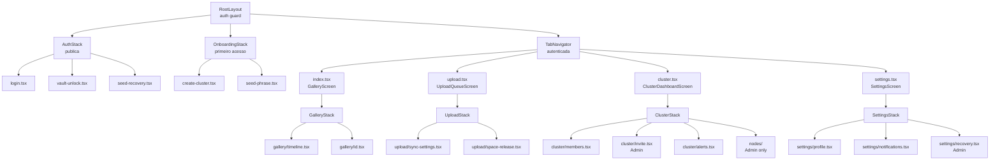

# Rotas e Navegacao

Define a estrutura de navegacao do app, a estrategia de protecao de rotas e os padroes de navegadores e telas. Este documento serve como mapa central de toda a navegacao do app mobile, garantindo que cada tela tenha protecao, navegador e proposito bem definidos.

---

## Estrutura de Navegacao

> Como as telas estao organizadas por navegador?

<!-- do blueprint: 08-use_cases.md (UC-001 a UC-007), 00-context.md (atores e roles), mobile/01-architecture.md (dominios) -->

| Tela                         | Tipo                 | Navegador              | Screen                       |
| ---------------------------- | -------------------- | ---------------------- | ---------------------------- |
| Login                        | Publica              | `AuthStack`            | `LoginScreen`                |
| Vault Unlock                 | Publica (pos-login)  | `AuthStack`            | `VaultUnlockScreen`          |
| Seed Recovery                | Publica              | `AuthStack`            | `SeedRecoveryScreen`         |
| Criar Cluster (1a vez)       | Publica (onboarding) | `OnboardingStack`      | `CreateClusterScreen`        |
| Exibir Seed Phrase           | Publica (onboarding) | `OnboardingStack`      | `SeedPhraseDisplayScreen`    |
| Galeria                      | Protegida            | `TabNavigator` (tab 1) | `GalleryScreen`              |
| Timeline                     | Protegida            | `GalleryStack`         | `TimelineScreen`             |
| Detalhe de Foto/Video        | Protegida            | `GalleryStack`         | `PhotoDetailScreen`          |
| Fila de Upload               | Protegida            | `TabNavigator` (tab 2) | `UploadQueueScreen`          |
| Configuracoes de Sync        | Protegida            | `UploadStack`          | `SyncSettingsScreen`         |
| Liberacao de Espaco          | Protegida            | `UploadStack`          | `SpaceReleaseScreen`         |
| Cluster Dashboard            | Protegida            | `TabNavigator` (tab 3) | `ClusterDashboardScreen`     |
| Membros                      | Protegida            | `ClusterStack`         | `MembersScreen`              |
| Convidar Membro              | Admin                | `ClusterStack`         | `InviteMemberScreen`         |
| Alertas                      | Protegida            | `ClusterStack`         | `AlertsScreen`               |
| Nos de Armazenamento         | Admin                | `NodesStack`           | `NodesScreen`                |
| Detalhe do No                | Admin                | `NodesStack`           | `NodeDetailScreen`           |
| Registrar No                 | Admin                | `NodesStack`           | `RegisterNodeScreen`         |
| Configuracoes                | Protegida            | `TabNavigator` (tab 4) | `SettingsScreen`             |
| Perfil do Membro             | Protegida            | `SettingsStack`        | `ProfileScreen`              |
| Configuracoes de Notificacao | Protegida            | `SettingsStack`        | `NotificationSettingsScreen` |
| Recovery via Seed            | Admin                | `SettingsStack`        | `SeedRecoveryScreen`         |

<!-- APPEND:rotas -->

<details>
<summary>Estrutura de arquivos — Expo Router (app/)</summary>

```
app/
  _layout.tsx                    # Root layout — auth guard, providers, fonts
  +not-found.tsx                 # Tela de rota nao encontrada

  (auth)/                        # Grupo publico — sem tabs
    _layout.tsx                  # Stack sem header
    login.tsx                    # LoginScreen
    vault-unlock.tsx             # VaultUnlockScreen
    seed-recovery.tsx            # SeedRecoveryScreen

  (onboarding)/                  # Grupo de primeiro acesso
    _layout.tsx                  # Stack com progress indicator
    create-cluster.tsx           # CreateClusterScreen
    seed-phrase.tsx              # SeedPhraseDisplayScreen (exibe 12 palavras)

  (tabs)/                        # Grupo autenticado — Bottom Tab Navigator
    _layout.tsx                  # Tab navigator: Gallery, Upload, Cluster, Settings
    index.tsx                    # GalleryScreen (tab 1)
    upload.tsx                   # UploadQueueScreen (tab 2)
    cluster.tsx                  # ClusterDashboardScreen (tab 3)
    settings.tsx                 # SettingsScreen (tab 4)

  gallery/                       # GalleryStack — telas empilhadas da galeria
    _layout.tsx
    timeline.tsx                 # TimelineScreen — navegacao por data
    [id].tsx                     # PhotoDetailScreen — rota dinamica

  upload/                        # UploadStack
    _layout.tsx
    sync-settings.tsx            # SyncSettingsScreen
    space-release.tsx            # SpaceReleaseScreen

  cluster/                       # ClusterStack
    _layout.tsx
    members.tsx                  # MembersScreen
    invite.tsx                   # InviteMemberScreen (admin)
    alerts.tsx                   # AlertsScreen

  nodes/                         # NodesStack (admin only)
    _layout.tsx                  # Admin role guard
    index.tsx                    # NodesScreen
    [id].tsx                     # NodeDetailScreen — rota dinamica
    register.tsx                 # RegisterNodeScreen

  settings/                      # SettingsStack
    _layout.tsx
    profile.tsx                  # ProfileScreen
    notifications.tsx            # NotificationSettingsScreen
    recovery.tsx                 # SeedRecoveryScreen (admin)
```

</details>

---

## Tipos de Navegador

> Quais navegadores sao utilizados e como se encaixam?

<!-- do blueprint: mobile/00-frontend-vision.md (Expo Router v4), mobile/01-architecture.md (UI Layer) -->

| Navegador         | Tipo          | Telas                                    | Comportamento                                                           |
| ----------------- | ------------- | ---------------------------------------- | ----------------------------------------------------------------------- |
| `RootNavigator`   | Stack         | AuthStack, OnboardingStack, TabNavigator | Controla fluxo raiz — auth guard redireciona conforme `isAuthenticated` |
| `AuthStack`       | Stack         | Login, VaultUnlock, SeedRecovery         | Sem header; animacao de slide vertical; Esc fecha vault unlock          |
| `OnboardingStack` | Stack         | CreateCluster, SeedPhraseDisplay         | Sem back button em SeedPhraseDisplay (obriga confirmacao)               |
| `TabNavigator`    | Bottom Tabs   | Gallery, Upload, Cluster, Settings       | 4 tabs; `AlertBadge` no tab Cluster; transicao nativa por plataforma    |
| `GalleryStack`    | Stack         | Timeline, PhotoDetail                    | Header transparente sobre foto; swipe-back nativo (iOS)                 |
| `UploadStack`     | Stack         | SyncSettings, SpaceRelease               | Header com titulo e botao de fechar                                     |
| `ClusterStack`    | Stack         | Members, InviteMember, Alerts            | Header com titulo; InviteMember como modal (sheet)                      |
| `NodesStack`      | Stack (Admin) | Nodes, NodeDetail, RegisterNode          | Role guard: redireciona para ClusterDashboard se nao for admin          |
| `SettingsStack`   | Stack         | Profile, Notifications, Recovery         | Header com back button; Recovery como modal                             |



---

## Protecao de Rotas

> Como telas protegidas verificam autenticacao e autorizacao?

<!-- do blueprint: 08-use_cases.md (UC-001, UC-002 — roles admin/member/reader), 00-context.md (Administrador Familiar, Membro Familiar) -->

| Tipo                           | Guard                                                                 | Redirect se Falhar     |
| ------------------------------ | --------------------------------------------------------------------- | ---------------------- |
| Publica                        | Nenhum                                                                | N/A                    |
| Protegida (autenticada)        | `isAuthenticated` no root layout                                      | `/(auth)/login`        |
| Protegida (vault desbloqueado) | `vaultUnlocked` no root layout                                        | `/(auth)/vault-unlock` |
| Admin                          | `isAuthenticated` + `member.role === 'admin'` no layout do NodesStack | `/(tabs)/cluster`      |

**Estrategia de protecao no root layout:**

O `app/_layout.tsx` e o unico ponto de controle de autenticacao. Ao montar, ele:

1. Chama `authStore.restoreSession()` — tenta restaurar JWT do `expo-secure-store`
2. Enquanto carrega → exibe `SplashScreen` (sem redirect)
3. Se nao autenticado e fora do grupo `(auth)` → redireciona para `/(auth)/login`
4. Se autenticado mas vault bloqueado → redireciona para `/(auth)/vault-unlock`
5. Se autenticado e vault desbloqueado em tela `(auth)` → redireciona para `/(tabs)`

O grupo `(nodes)/` tem um segundo guard em seu proprio `_layout.tsx` que verifica `member.role === 'admin'`.

<details>
<summary>Implementacao — Auth guard com Expo Router v4</summary>

```tsx
// app/_layout.tsx
import { useEffect } from 'react';
import { useSegments, useRouter } from 'expo-router';
import { useAuthStore } from '@/features/auth/store/auth-store';
import { SplashScreen } from 'expo-router';

SplashScreen.preventAutoHideAsync();

export default function RootLayout() {
  const { isAuthenticated, vaultUnlocked, isLoading, restoreSession } = useAuthStore();
  const segments = useSegments();
  const router = useRouter();

  useEffect(() => {
    restoreSession();
  }, []);

  useEffect(() => {
    if (isLoading) return;

    SplashScreen.hideAsync();

    const inAuthGroup = segments[0] === '(auth)';
    const inOnboarding = segments[0] === '(onboarding)';

    if (!isAuthenticated && !inAuthGroup) {
      router.replace('/(auth)/login');
    } else if (isAuthenticated && !vaultUnlocked && !inAuthGroup) {
      router.replace('/(auth)/vault-unlock');
    } else if (isAuthenticated && vaultUnlocked && (inAuthGroup || inOnboarding)) {
      router.replace('/(tabs)');
    }
  }, [isAuthenticated, vaultUnlocked, isLoading, segments]);

  return <Slot />;
}
```

```tsx
// app/nodes/_layout.tsx — guard de admin
import { Redirect } from 'expo-router';
import { useAuthStore } from '@/features/auth/store/auth-store';

export default function NodesLayout() {
  const { member } = useAuthStore();

  if (member?.role !== 'admin') {
    return <Redirect href="/(tabs)/cluster" />;
  }

  return <Stack />;
}
```

</details>

---

## Deep Linking

> Como o app responde a links externos?

<!-- do blueprint: 08-use_cases.md (UC-002 — link de convite via token), 00-context.md (Sync Engine em dispositivos) -->

| Tipo                        | Configuracao                                            | Exemplo                                              |
| --------------------------- | ------------------------------------------------------- | ---------------------------------------------------- |
| URL Scheme                  | `alexandria://`                                         | `alexandria://invite/tok_abc123`                     |
| Universal Links (iOS)       | `apple-app-site-association` no dominio do Orquestrador | `https://cluster.familia.com/invite/tok_abc123`      |
| App Links (Android)         | `assetlinks.json` no dominio do Orquestrador            | `https://cluster.familia.com/invite/tok_abc123`      |
| Push Notification Deep Link | Payload `{ screen, params }` via `expo-notifications`   | Abre `AlertsScreen` ao tocar em alerta de no offline |

| Link Externo       | Tela de Destino                        | Parametros                                     |
| ------------------ | -------------------------------------- | ---------------------------------------------- |
| `/invite/:token`   | `InviteMemberScreen` (aceitar convite) | `token` — valida assinatura e expiracao        |
| `/gallery/:fileId` | `PhotoDetailScreen`                    | `fileId` — abre detalhe direto                 |
| `/cluster/alerts`  | `AlertsScreen`                         | — — notificacao push de alerta critico         |
| `/nodes/:nodeId`   | `NodeDetailScreen`                     | `nodeId` — notificacao de no offline (admin)   |
| `/recovery`        | `SeedRecoveryScreen`                   | — — deep link de suporte para iniciar recovery |

---

## Navegacao

> Como o usuario navega entre secoes?

<!-- do blueprint: mobile/00-frontend-vision.md (gestos nativos, haptic feedback), 00-context.md (Membro Familiar, Guardiao de Memorias) -->

- Navegacao principal: **Bottom Tabs** com 4 abas (Gallery, Upload, Cluster, Settings)
- Navegacao secundaria: **Stack push** para telas de detalhe dentro de cada tab
- Gestos: **Swipe back** (iOS) em todas as telas de detalhe; **Pinch-to-zoom** no `PhotoDetailScreen`; **Swipe horizontal** entre fotos no `PhotoDetailScreen`; **Swipe to resolve** em `AlertItem`
- Deep linking: **Universal Links** (iOS/Android) + **URL Scheme** (`alexandria://`)

| Elemento           | Visivel em                                                   | Comportamento                                                      |
| ------------------ | ------------------------------------------------------------ | ------------------------------------------------------------------ |
| Bottom Tab Bar     | Todas as telas das tabs                                      | 4 tabs: Gallery (Home), Upload, Cluster (com AlertBadge), Settings |
| Stack Header       | Telas de detalhe (Timeline, PhotoDetail, Members, etc.)      | Back button + titulo + action icons contextuais                    |
| BottomSheet        | Acoes contextuais (InviteMember, RegisterNode, confirmacoes) | Gestos nativos de dismiss; `react-native-bottom-sheet`             |
| PhotoDetail Header | `PhotoDetailScreen`                                          | Transparente sobre a foto; botoes de Download e Opcoes             |

> Para detalhes sobre protecao de rotas e autenticacao, (ver 11-security.md).

---

## Historico de Decisoes

| Data       | Decisao                                                           | Motivo                                                                                                                     |
| ---------- | ----------------------------------------------------------------- | -------------------------------------------------------------------------------------------------------------------------- |
| 2026-03-24 | Expo Router v4 (file-based) em vez de React Navigation imperative | Consistencia com Next.js (mesma convencao de rotas), deep linking automatico, typed routes                                 |
| 2026-03-24 | 4 Bottom Tabs (Gallery, Upload, Cluster, Settings)                | Cada tab mapeia para um dominio principal; evitar mais de 5 tabs por convencao HIG/Material                                |
| 2026-03-24 | Auth guard no root layout (nao middleware)                        | Expo Router nao tem middleware; root layout e o equivalente correto                                                        |
| 2026-03-24 | NodesStack como grupo separado com admin guard proprio            | Nodes e funcionalidade exclusiva do admin; isolar em grupo proprio evita leakage de UI para membros comuns                 |
| 2026-03-24 | VaultUnlock como tela separada de Login                           | O vault e desbloqueado localmente (sem chamada de API); separar permite restaurar sessao sem re-autenticar no Orquestrador |
