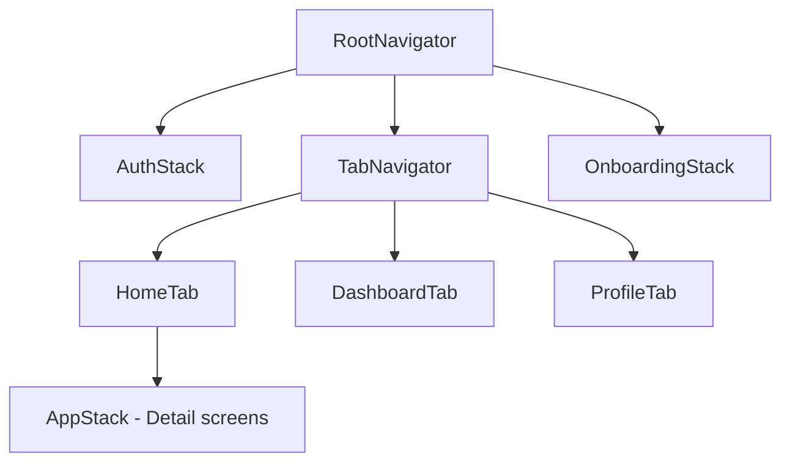

# Rotas e Navegacao

Define a estrutura de navegacao do app, a estrategia de protecao de rotas e os padroes de navegadores e telas. Este documento serve como mapa central de toda a navegacao do app mobile, garantindo que cada tela tenha protecao, navegador e proposito bem definidos.

---

## Estrutura de Navegacao

> Como as telas estao organizadas por navegador?

| Tela | Tipo | Navegador | Screen |
|------|------|-----------|--------|
| Home | Protegida | `TabNavigator` | {{HomeScreen}} |
| Login | Publica | `AuthStack` | {{LoginScreen}} |
| Register | Publica | `AuthStack` | {{RegisterScreen}} |
| Dashboard | Protegida | `TabNavigator` | {{DashboardScreen}} |
| Settings | Protegida | `TabNavigator` | {{SettingsScreen}} |
| Profile | Protegida | `AppStack` | {{ProfileScreen}} |
| Admin/Users | Admin | `AdminStack` | {{AdminUsersScreen}} |
| {{tela-adicional}} | {{Tipo}} | {{Navegador}} | {{Screen}} |

<!-- APPEND:rotas -->

<details>
<summary>Exemplo — Estrutura Expo Router</summary>

```
app/
  _layout.tsx              # Root layout (providers, auth check)
  +not-found.tsx           # 404 screen
  (auth)/
    _layout.tsx            # Auth stack (sem tabs)
    login.tsx              # Login screen
    register.tsx           # Register screen
    forgot-password.tsx    # Forgot password
  (tabs)/
    _layout.tsx            # Tab navigator config
    index.tsx              # Home tab
    dashboard.tsx          # Dashboard tab
    profile.tsx            # Profile tab
    settings.tsx           # Settings tab
  (app)/
    _layout.tsx            # App stack (telas internas)
    file/[id].tsx          # File detail (dynamic route)
    notifications.tsx      # Notifications screen
  (admin)/
    _layout.tsx            # Admin stack (role guard)
    users.tsx              # Admin users
```

</details>

---

## Tipos de Navegador

> Quais navegadores sao utilizados e como se encaixam?

| Navegador | Tipo | Telas | Comportamento |
|-----------|------|-------|---------------|
| RootNavigator | Stack | Auth, Tabs, Onboarding | Controla fluxo principal (auth vs app) |
| AuthStack | Stack | Login, Register, ForgotPassword | Telas sem autenticacao |
| TabNavigator | Bottom Tabs | Home, Dashboard, Profile, Settings | Navegacao principal do app |
| AppStack | Stack | Detalhes, Modais, Formularios | Telas empilhadas dentro das tabs |
| AdminStack | Stack | Admin screens | Requer role de admin |
| {{NavegadorAdicional}} | {{Tipo}} | {{Telas}} | {{Comportamento}} |



---

## Protecao de Rotas

> Como telas protegidas verificam autenticacao e autorizacao?

| Tipo | Guard | Redirect se Falhar |
|------|-------|--------------------|
| Publicas | Nenhum | N/A |
| Protegidas | Auth guard no root layout | Tela de Login |
| Admin | Auth + role check | Dashboard (sem permissao) ou Login (sem auth) |

{{Descreva a estrategia de protecao — verificacao no root layout e/ou middleware de navegacao}}

<details>
<summary>Exemplo — Auth guard com Expo Router</summary>

```tsx
// app/_layout.tsx
export default function RootLayout() {
  const { isAuthenticated, isLoading } = useAuthStore();
  const segments = useSegments();
  const router = useRouter();

  useEffect(() => {
    if (isLoading) return;
    const inAuthGroup = segments[0] === '(auth)';

    if (!isAuthenticated && !inAuthGroup) {
      router.replace('/(auth)/login');
    } else if (isAuthenticated && inAuthGroup) {
      router.replace('/(tabs)');
    }
  }, [isAuthenticated, segments, isLoading]);

  if (isLoading) return <SplashScreen />;

  return <Slot />;
}
```

</details>

---

## Deep Linking

> Como o app responde a links externos?

| Tipo | Configuracao | Exemplo |
|------|-------------|---------|
| URL Scheme | {{myapp://}} | `myapp://profile/123` |
| Universal Links (iOS) | {{apple-app-site-association}} | `https://app.com/file/123` |
| App Links (Android) | {{assetlinks.json}} | `https://app.com/file/123` |
| Push Notification Deep Link | {{Payload com rota}} | Abrir tela de detalhe ao tocar na notificacao |

| Link Externo | Tela de Destino | Parametros |
|--------------|----------------|------------|
| {{/file/:id}} | {{FileDetailScreen}} | {{id}} |
| {{/invite/:code}} | {{InviteScreen}} | {{code}} |
| {{/reset-password/:token}} | {{ResetPasswordScreen}} | {{token}} |
| {{Link adicional}} | {{Tela}} | {{Params}} |

---

## Navegacao

> Como o usuario navega entre secoes?

- Navegacao principal: {{Bottom Tabs}}
- Navegacao secundaria: {{Stack push para detalhes}}
- Gestos: {{Swipe back (iOS), swipe para acoes em listas}}
- Deep linking: {{Universal Links + URL Scheme}}

| Elemento | Visivel em | Comportamento |
|----------|-----------|---------------|
| {{Bottom Tab Bar}} | {{Telas principais}} | {{4-5 tabs com icones + labels}} |
| {{Header}} | {{Telas de detalhe}} | {{Back button + titulo + acoes}} |
| {{Drawer}} | {{Se aplicavel}} | {{Menu lateral com navegacao secundaria}} |

> Para detalhes sobre protecao de rotas e autenticacao, (ver 11-security.md).

---

## Historico de Decisoes

| Data | Decisao | Motivo |
|------|---------|--------|
| {{YYYY-MM-DD}} | {{Decisao sobre navegacao}} | {{Justificativa}} |
