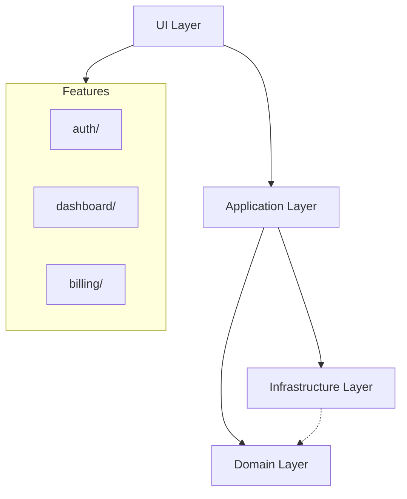

# Arquitetura do Frontend

Define a arquitetura em camadas do frontend, inspirada em Clean Architecture adaptada para aplicacoes client-side. Estabelece fronteiras claras entre UI, logica de aplicacao, dominio e infraestrutura, garantindo que cada parte do sistema tenha responsabilidade bem definida e que mudancas em uma camada nao impactem as demais.

> **Implementa:** [docs/blueprint/06-system-architecture.md](../blueprint/06-system-architecture.md) (componentes e deploy) e [docs/blueprint/02-architecture_principles.md](../blueprint/02-architecture_principles.md) (principios).
> **Complementa:** [docs/backend/01-architecture.md](../backend/01-architecture.md) (camadas do backend).

---

## Camadas Arquiteturais

> Como o frontend esta organizado em camadas? Qual a responsabilidade de cada uma?

```
UI Layer (Pages, Layouts, Components)
        ↓
Application Layer (Hooks, Orchestration, State)
        ↓
Domain Layer (Models, Business Rules, Interfaces)
        ↓
Infrastructure Layer (API Client, Storage, Analytics)
```

| Camada | Responsabilidade | Pode acessar | NAO pode acessar |
| --- | --- | --- | --- |
| UI Layer | Renderizacao, interacao visual, layout | Application, Domain | Infrastructure diretamente |
| Application Layer | Orquestracao, hooks de negocio, estado | Domain, Infrastructure | — |
| Domain Layer | Modelos, regras de negocio, interfaces | Nenhuma outra camada | UI, Application, Infrastructure |
| Infrastructure Layer | API client, storage, analytics, SDKs | Domain (implementa interfaces) | UI, Application |

<details>
<summary>Exemplo — Responsabilidade de cada camada</summary>

- **UI Layer:** `UserProfilePage` renderiza dados do usuario usando componentes visuais. Nao sabe de onde vem os dados.
- **Application Layer:** `useUserProfile(id)` orquestra o fetch, trata loading/error e retorna dados prontos para a UI.
- **Domain Layer:** `User` define o modelo, `canEditProfile(user)` contem a regra de negocio.
- **Infrastructure Layer:** `userApi.getById(id)` faz o fetch HTTP real, injeta token, trata retry.

</details>

---

## Regras de Dependencia

> Quais sao as regras de importacao entre camadas?

- UI Layer pode importar de Application e Domain
- Application Layer pode importar de Domain e Infrastructure
- Domain Layer NAO importa de nenhuma outra camada
- Infrastructure Layer implementa interfaces definidas em Domain

> A regra de ouro: dependencias apontam sempre para dentro (em direcao ao Domain). Nenhuma camada interna conhece camadas externas.

---

## Fronteiras de Dominio

> O frontend esta organizado por dominio de negocio (features)?

| Dominio | Responsabilidade | Componentes Proprios | Estado Proprio |
| --- | --- | --- | --- |
| {{auth}} | {{Autenticacao e autorizacao}} | {{LoginForm, AuthGuard}} | {{authStore}} |
| {{dashboard}} | {{Painel principal e metricas}} | {{DashboardGrid, MetricCard}} | {{dashboardStore}} |
| {{billing}} | {{Planos, pagamentos e faturas}} | {{PlanSelector, InvoiceList}} | {{billingStore}} |
| {{storage}} | {{Upload e gerenciamento de arquivos}} | {{FileUploader, FileList}} | {{storageStore}} |
| {{Outro dominio}} | {{Responsabilidade}} | {{Componentes}} | {{Store}} |

<!-- APPEND:dominios -->

> Cada dominio possui: `components/`, `hooks/`, `api/`, `types/`, `services/`

> Detalhes da estrutura de pastas: (ver 02-project-structure.md)

---

## Comunicacao entre Domínios

> Como features diferentes se comunicam sem acoplamento direto?

- Features NAO importam diretamente umas das outras
- Comunicacao via Event Bus leve ou estado global compartilhado
- Componentes compartilhados vivem fora das features, em `components/`

> Detalhes sobre Event Bus: (ver 05-state.md)

---

## Diagrama de Arquitetura

> 📐 Diagrama: [frontend-architecture.mmd](../diagrams/frontend/frontend-architecture.mmd)

{{Descreva o diagrama de arquitetura ou referencie o arquivo Mermaid}}



> Mantenha o diagrama atualizado conforme a arquitetura evolui. (ver 00-visao-frontend.md para contexto geral)
