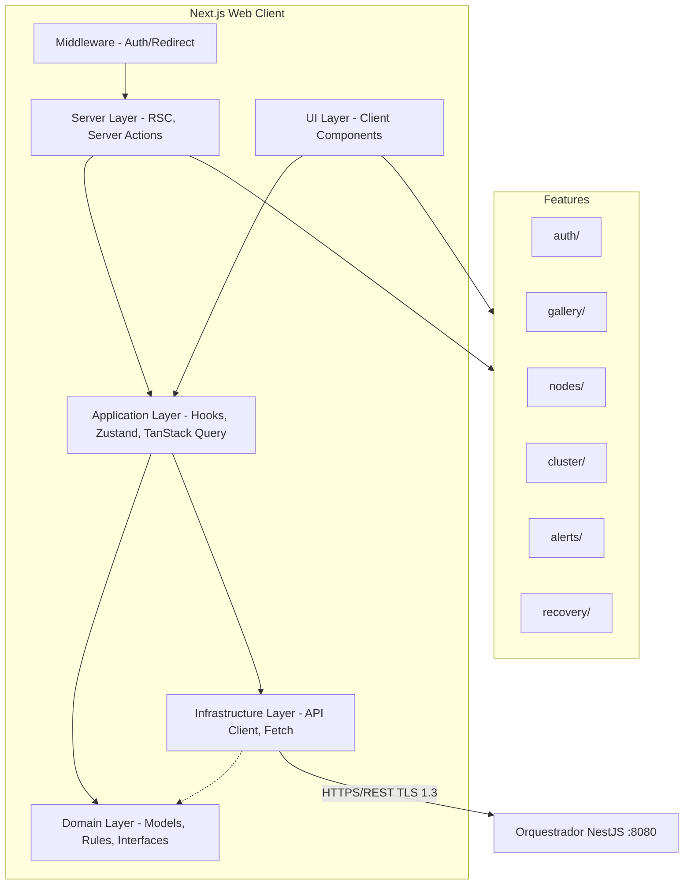

# Arquitetura do Frontend Web

Define a arquitetura em camadas do frontend web (Next.js 16), inspirada em Clean Architecture adaptada para aplicações client-side com Server Components. Estabelece fronteiras claras entre UI, lógica de aplicação, domínio e infraestrutura, garantindo que cada parte do sistema tenha responsabilidade bem definida e que mudanças em uma camada não impactem as demais.

> **Implementa:** [docs/blueprint/06-system-architecture.md](../../blueprint/06-system-architecture.md) (componentes e deploy) e [docs/blueprint/02-architecture_principles.md](../../blueprint/02-architecture_principles.md) (princípios).
> **Complementa:** [docs/backend/01-architecture.md](../../backend/01-architecture.md) (camadas do backend).

<!-- do blueprint: 06-system-architecture.md, 02-architecture_principles.md, 10-architecture_decisions.md -->

---

## Camadas Arquiteturais

> Como o frontend web está organizado em camadas? Qual a responsabilidade de cada uma?

```
Server Layer (RSC, Server Actions, Middleware)
        ↓
UI Layer (Pages, Layouts, Client Components)
        ↓
Application Layer (Hooks, Orchestration, State)
        ↓
Domain Layer (Models, Business Rules, Interfaces)
        ↓
Infrastructure Layer (API Client, Storage, Analytics)
```

| Camada | Responsabilidade | Pode acessar | NÃO pode acessar |
| --- | --- | --- | --- |
| Server Layer | Server Components (RSC), Server Actions, middleware de auth, redirecionamento, streaming SSR | Application, Domain, Infrastructure | Estado client-side (Zustand, event bus) |
| UI Layer | Renderização de Client Components, interação visual, layouts, formulários | Application, Domain | Infrastructure diretamente |
| Application Layer | Orquestração, hooks de negócio, estado global (Zustand), data fetching (TanStack Query) | Domain, Infrastructure | — |
| Domain Layer | Modelos TypeScript, regras de negócio, interfaces/contratos | Nenhuma outra camada | UI, Application, Infrastructure |
| Infrastructure Layer | API client (fetch), localStorage, analytics, SDKs externos | Domain (implementa interfaces) | UI, Application |

<details>
<summary>Exemplo — Responsabilidade de cada camada</summary>

- **Server Layer:** `app/dashboard/page.tsx` é um Server Component que faz fetch de dados do orquestrador no servidor e passa via props. Middleware verifica JWT e redireciona para `/login` se inválido.
- **UI Layer:** `GalleryGrid` (Client Component) renderiza thumbnails usando dados recebidos por props. Não sabe de onde vêm os dados.
- **Application Layer:** `useFiles(clusterId)` orquestra TanStack Query, trata loading/error e retorna dados prontos para a UI. `uploadStore` (Zustand) gerencia a fila de upload.
- **Domain Layer:** `File` define o modelo, `canDownload(file, member)` contém a regra de negócio, `FileStatus` define os estados possíveis.
- **Infrastructure Layer:** `filesApi.upload(file)` faz o POST multipart real, injeta JWT, trata retry com backoff.

</details>

---

## Regras de Dependência

> Quais são as regras de importação entre camadas?

- Server Layer pode importar de Application, Domain e Infrastructure (acesso direto para data fetching server-side)
- UI Layer pode importar de Application e Domain
- Application Layer pode importar de Domain e Infrastructure
- Domain Layer NÃO importa de nenhuma outra camada
- Infrastructure Layer implementa interfaces definidas em Domain
- Features NÃO importam diretamente umas das outras

> A regra de ouro: dependências apontam sempre para dentro (em direção ao Domain). Nenhuma camada interna conhece camadas externas.

### Hydration Boundaries

- Server Components (RSC) fazem fetch de dados e passam via props
- Client Components recebem dados serializáveis como props iniciais
- `"use client"` marca a fronteira — usado apenas quando necessário (estado, efeitos, event handlers)
- Streaming SSR via `<Suspense>` para progressive rendering de seções pesadas (galeria)

---

## Fronteiras de Domínio

> O frontend web está organizado por domínio de negócio (features)?

<!-- do blueprint: 04-domain-model.md (entidades), 08-use_cases.md (casos de uso) -->

| Domínio | Responsabilidade | Componentes Próprios | Estado Próprio |
| --- | --- | --- | --- |
| auth | Autenticação JWT, proteção de rotas, seed phrase | LoginForm, SeedPhraseDisplay, SeedPhraseInput, AuthGuard | authStore (JWT, member, role) |
| gallery | Upload, galeria de fotos/vídeos/documentos, busca, download | UploadDropzone, UploadQueue, GalleryGrid, GalleryTimeline, FileLightbox, SearchBar | uploadStore (fila), useFiles (TanStack Query) |
| nodes | Gerenciamento de nós, monitoramento, drain | NodeList, NodeStatusBadge, AddNodeModal, DrainProgressBar | useNodes (TanStack Query) |
| cluster | Criação de cluster, onboarding, convites | SetupClusterForm, InviteMemberModal, InviteLinkCopy, AcceptInviteForm | useCluster (TanStack Query) |
| alerts | Alertas de saúde, notificações administrativas | AlertBell, AlertDropdown, AlertCard | useAlerts (TanStack Query) |
| recovery | Recovery via seed phrase, rebuild de banco | RecoveryStepper, RecoveryProgress, RecoveryReport | recoveryStore (etapas, progresso) |
| settings | Configurações do cluster e do membro | SettingsForm, MemberList, RoleSelector | useSettings (TanStack Query) |

<!-- APPEND:dominios -->

> Cada domínio possui: `components/`, `hooks/`, `api/`, `types/`, `services/`

> Detalhes da estrutura de pastas: (ver [02-project-structure.md](02-project-structure.md))

---

## Comunicação entre Domínios

> Como features diferentes se comunicam sem acoplamento direto?

- Features NÃO importam diretamente umas das outras
- Comunicação via Event Bus leve (pub/sub em memória) para eventos cross-feature:
  - `file:uploaded` → gallery atualiza grid, alerts verifica replicação
  - `node:lost` → alerts exibe notificação, nodes atualiza status
  - `cluster:created` → auth atualiza role, gallery exibe empty state
- Estado compartilhado somente via stores globais (Zustand) quando inevitável (ex.: `authStore` para JWT)
- Componentes compartilhados (Button, Card, Toast, etc.) vivem fora das features, em `components/ui/`

> Detalhes sobre Event Bus: (ver [05-state.md](05-state.md))

---

## Middleware e Server-Side

> Como funciona a camada server-side do Next.js no Alexandria?

| Componente | Responsabilidade | Localização |
| --- | --- | --- |
| Middleware | Verificação de JWT em todas as rotas protegidas; redirect para `/login` ou `/setup` ou `/recovery` conforme estado do sistema | `middleware.ts` (root) |
| Server Components | Fetch de dados do orquestrador no servidor para SSR; sem bundle client-side | `app/**/page.tsx` |
| Server Actions | Mutações simples (ex.: marcar alerta como resolvido) sem criar endpoint API separado | `app/**/actions.ts` |
| API Routes | Proxy para o orquestrador quando necessário (ex.: upload multipart com progress) | `app/api/**` |

### Fluxo de Autenticação no Middleware

```
Request → middleware.ts
  ├─ JWT válido + cluster existe → continua para página
  ├─ JWT válido + sem cluster → redirect /setup
  ├─ JWT inválido + rota protegida → redirect /login
  ├─ Sem cluster + banco vazio → redirect /recovery (ou /setup)
  └─ Rota pública (/login, /invite/:token) → continua
```

---

## Diagrama de Arquitetura

> 📐 Diagrama: [web-architecture.mmd](../diagrams/frontend/web-architecture.mmd)



> Mantenha o diagrama atualizado conforme a arquitetura evolui. (ver [00-frontend-vision.md](00-frontend-vision.md) para contexto geral)
